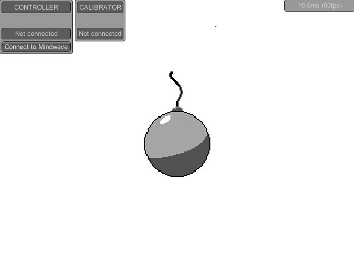

# Mindwave Unity - Bomb Game

In this project's `Assets/` directory, you can find a `Demo/` directory. It's a simple game, as an example of how and for what using the library.

## Preview

## Start

Load the "MainScene" at `Assets/Demo/Scenes/Game_MainScene.unity`, and run the game.

First of all, click "Connect to Mindwave" button. If the connection can't be established, [check known issues](./KnownIssues.md).

## Gameplay

* Relax, take a deep breath, and try to **set your meditation valueup to 70**
* Once this goal have been reached, **hold your meditation value over 20 during 5 seconds**
* The bomb's wick will fire. Focus a point (or sing a song in your head) to **set your attention value up to 70**.
* **BOOM!**

***Hints**: The bomb grows depending on your meditation, and the wick disappears depending on your attention.*