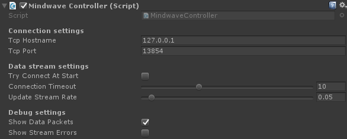

# Mindwave Unity - Controller

The `MindwaveController` makes the binding from Mindwave device and your app. It gets data from the socket (provided by [ThinkGear Connector](http://developer.neurosky.com/docs/doku.php?id=thinkgear_connector_tgc)), and emit events for transmitting these informations.

## Preview



## Usage

### Integration

#### Using the [`MindwaveManager`](./MindwaveManager.md)

You can just drag and drop the "MindwaveManager" prefab (at `Plugins/MindwaveUnity/Utilities/MindwaveManager.prefab`). The `MindwaveController` is already correctly set.

You can also put the [`MindwaveManager`](./MindwaveManager.md) component on a GameObject. An instance of `MindwaveController` will automatically be added to that GameObject.

#### Integration without [`MindwaveManager`](./MindwaveManager.md)

Put this component on a GameObject. It's already ready to work.

Change the settings as you need.

### Settings

#### Connection settings

The data are sent by [ThinkGear Connector](http://developer.neurosky.com/docs/doku.php?id=thinkgear_connector_tgc), and can be get from a web socket. `MindwaveController` uses `System.Net.Sockets.TcpClient` to connect and listen to this socket.

* **TCP Hostname**: The hostname of TCP client. Default is `127.0.0.1`.
* **TCP Port**: The port of TCP client. Default is `13854`.

#### Data stream settings

* **Try Connect At Start**: Initializes the headset connection at the game start. ***Note**: The connection with the headset will make your game drop some frames... You better initialize the connection to the Mindwave device in a dedicated lobby or loading screen.*
* **Connection Timeout**: Defines the timing before the connection to the headset should stop if unsuccessful.
* **Update Stream Rate**: Defines the interval between each data update from the headset.

#### Debug settings

* **Show Data Packets**: Displays in console the raw JSON packets' content from the headset.
* **Show Stream Errors**: Displays in console the JSON packets' parsing errors. Errors usually happens because of incomplete JSON strings from [ThinkGear Connector](http://developer.neurosky.com/docs/doku.php?id=thinkgear_connector_tgc).

## Scripting

### Events

```csharp
// public delegate void VoidDelegate()
public event VoidDelegate OnConnectMindwave
```

Triggered when the connection to Mindwave device is established.

---

```csharp
// public delegate void VoidDelegate()
public event VoidDelegate OnDisconnectMindwave
```

Triggered when the connection to Mindwave device is lost (or `Disconnect()` has been called).

---

```csharp
// public delegate void VoidDelegate()
public event VoidDelegate OnConnectionTimeout
```

Triggered when the connection to Mindwave device timeouts.

---

```csharp
// public delegate void MindwaveDataDelegate(MidwaveDataModel)
public event MindwaveDataDelegate OnUpdateMindwaveData
```

Triggered when data are get from the Mindwave device.

---

```csharp
// public delegate void IntValueDelegate(int)
public event IntValueDelegate OnUpdateRawEEG
```

Triggered when raw EEG (Electroencephalogram) data are get from the Mindwave device.

---

```csharp
// public delegate void IntValueDelegate(int)
public event IntValueDelegate OnUpdateBlink
```

Triggered when blink strength info is get from the Mindwave device.

### Methods

```csharp
public void Connect()
```

Initializes the connection with the headset.

---

```csharp
public void Disconnect()
```

Disconnects from the headset.

---

```csharp
public bool IsConnecting { get; }
```

Checks if `MindwaveController` has initialized a connection to the headset.

---

```csharp
public bool IsConnected { get; }
```

Checks if `MindwaveController` is connected to the headset.

---

```csharp
public float TimeoutTimer { get; }
```

Gets the current timeout timer.

---

```csharp
public float ConnectionTimeoutDelay { get; }
```

Gets the connection timeout delay.