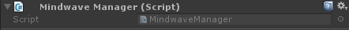

# Mindwave Unity - MindwaveManager

The `MindwaveManager` is just a shortcut for working with other components. It's a singleton, that requires [`MindwaveController`](./MindwaveController.md) and [`MindwaveCalibrator`](./MindwaveCalibrator.md) components.

It references these two components and provides the accessors to get them. As a singleton, you can access it from anywhere in your scripts, and it's garanteed that there's constantly only one instance of this component. It also ensures to maintain the connection to the headset during the whole game, even between scenes.

## Preview



## Usage

### Integration

You can just drag and drop the "MindwaveManager" prefab (at `Plugins/MindwaveUnity/Utilities/MindwaveManager.prefab`). It already has the components you need.

You can also put the `MindwaveManager` component on a GameObject. An instance of [`MindwaveController`](./MindwaveController.md) and [`MindwaveCalibrator`](./MindwaveCalibrator.md) will automatically be added to that GameObject.

## Scripting

### Accessors

```csharp
public MindwaveController Controller { get; }
```

---

```csharp
public MindwaveCalibrator Calibrator { get; }
```