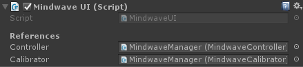

# Mindwave Unity - Default UI

That component invites you to connect to the headset through GUI buttons, and clearly display the Mindwave data.

## Preview

## Usage

### Integration

You can just drag and drop the "MindwaveManager" prefab (at `Plugins/MindwaveUnity/Utilities/MindwaveManager.prefab`). `MindwaveUI` is already correctly set.

If you don't use the prefab, put this component on a GameObject. Set the references to [`MindwaveController`](./MindwaveController.md) and/or [`MindwaveCalibrator`](./MindwaveController.md), and that's it.