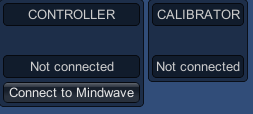

# Mindwave Unity

This is a Unity plugin for developping app and games with the *NeuroSky MindwaveMobile*, on the occasion of the [Serious Game Jam](www.eventbrite.fr/e/34697918408).

## Installation

First, pair the Mindwave device with you computer through Bluetooth. On Windows, go to Settings > Devices and click on "Add a Bluetooth or other device". In the popup, choose "Bluetooth", and wait for "MindwaveMobile" device to appear. Click on the device, and pair it using the code `0000`.

Then, you need to install [ThinkGear Connector](http://developer.neurosky.com/docs/doku.php?id=thinkgear_connector_tgc). It's a tool developped by NeuroSky that emit data from any of their device to a network socket. So it allows you to get data from the device, just like you get data from a website, using sockets.

Back to the Unity plugin. You can find a folder `Package` at the project root. Import that package into your Unity project.

This package contains the classes and components of the plugin, a demo scene and a "ready-to-use" prefab.

## Getting started

Open the demo scene. Put the Mindwave device on the head of somebody, or yourself. Ensure you have ThinkGear Connector running, and the headset turned on... If it doesn't turn on, you may have missed to put a battery in. No, I'm no judging, promise!

*NOTE: if you don't see your device in bluetooth managers, you should change the battery and pick a new one... Yeah, I know, that's weird, but it worked everytime for me.*

The demo scene only contains the `MindwaveManager` prefab (from `Plugins/MindwaveUnity/Utilities/MindwaveManager.prefab`). This prefab manages both `MindwaveController` and `MindwaveCalibrator`, detailed below. The prefab also have the `MindwaveUI` component, which is helpful for debug, and detailed below too.

All is ready ? Let's play the demo scene. You should see the following screen :

Click on "Connect to Mindwave" button. It initializes the connection to the Mindwave device. Note that it can fail if the headset is not put correctly (the front metallic part should touch the very center of the user's forehead).

Now, you should see something like this :

... Congratulations, this brain is working!

If the connection can't be established, try these:

* Turn off, and then turn on the headset, wait some seconds and retry
* Check if the headset appears in the Bluetooth devices. If not, change the battery and retry
* Quit ThinkGear Connector (totally, a process could still be running), then reopen it, and retry
* Still not working ? Mh, things become complicated. May you should restart your computer (in doubt...)
* ... I did my best :/

## Components

### MindwaveManager

The `MindwaveManager` is just a shortcut for working with other components. It's a singleton, that requires `MindwaveController` and `MindwaveCalibrator` components.

It references these two components and provides two accessors to get them : `Controller` and `Calibrator` (these components are detailed below). As a singleton, you can access it from anywhere in your scripts, and it's garanteed that there's constantly only one instance of this component.

#### Accessors

##### `public MindwaveController Controller`

##### `public MindwaveCalibrator Calibrator`

### MindwaveController

The `MindwaveController` makes the binding from the app and the Mindwave device. It gets data from the socket (provided by ThinkGear Connector), and emit events for transmitting these informations.

**TO DO**

### MindwaveCalibrator

This component is a helper for working with the very dynamic brainwave values (delta, theta, ...). It stores the incoming data from the `MindwaveController` (detailed above), and allow you to calculate averages and ratios. So, instead of having abstract value from 3000 to 1800000 (for example... delta brainwaves fluctuations made me crazy), you have a value from 0 to 1 that closely correspond to a current user... And that's really important: we all don't have the same brain!

**TO DO**

### MindwaveUI

That component invites you to connect to the headset through GUI buttons, and display clearly the Mindwave data. The displayed values come from the controller and the calibrator, that you can set as references on the component.

**TO DO**
